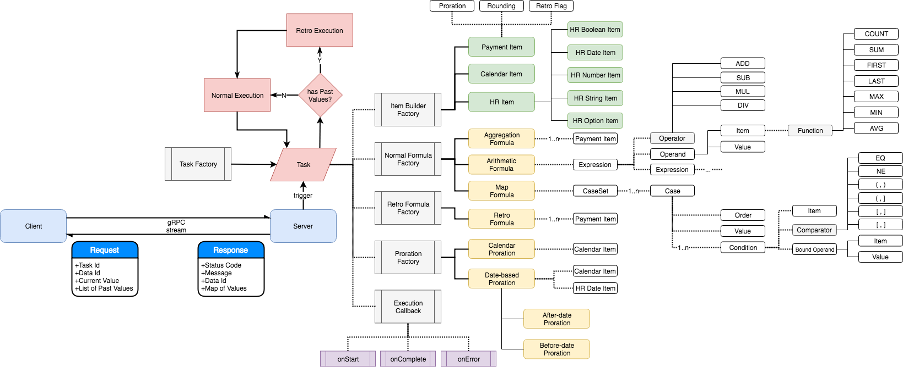

# Payroll Calculation Core

The core of payroll provides a general way to organize all payroll related
definitions and offer clients a unified way for all kinds of calculation.

## Overview

> [Google Drive](https://drive.google.com/file/d/1tM96jXBHbzjGYEemqEuiHBpjgKdTb2tw/view?usp=sharing)

## C/S Structure
The core are divided into client and server, which can run different PCs to offer 
the scalability to the whole syste.

Client and server communicate using the stream interface provided by gRPC w/ ProtoBuffer.

For more details, please refer the [calc-core.proto](src/main/proto/calc-core.proto)

## Task
Task means a type of a job. A server is able to execute different tasks based on the 
task id given by the client. Moreover, client can pass different task id in the same
stream in order to perform different tasks.

## Execution
For each frame received from the stream, a task execution will be created based on the task definition.
A frame is a complete set of data in order to perform the calculation for an indentity in a given period,
typically, the information of an employee in the monthly payroll calculation, indentified by employee id.

A task execution contains a execution context and a execution callback.

The execution context is initialized with data received from stream frame. During the execution, 
it holds all the intermediate results as well as the final the results. After the exeuction, it 
will be returned to the client as response.

The execution callback provides an entry point to access data when execution start, success or fail. 
With the help of callback, we can handle the execution results as well as the errors during the execution.

## Item
Items are entities that hold data to feed the exeuction. Within the execution period, 
items can have different values. This enables the items to handle data changes 
within the execution period. Each value of the item is indentifier by its start date.

There are 3 kinds of items:
* Calendar Items: handle calendar/attendenc related information, like working days, leave, overtime.
* HR Items: manage the hr related information, like position, citizenship and etc. 
* Payment Items: contains values for payments, which could be initial values, intermediate results, as well as final results.
    For Each payment item, different proration rules and rounding rules could be applied.

### Proration
Each proration rule links with a calender item and decides how to prorate the values of an item.

## Formula
A formula convert one of several items into values for a target payment item.
The task execution is actually performing the formulas on related items to get the result for target 
payment items. 

Same as the items, formulas can have different contents in the execution period as well. 

There are 3 kinds of formula supported by the system:
* Aggregation formula
* Arithmetic formula
* Map formula

### Aggregation Formula
The aggregation formula sum up the values of a list of items as the values for the target payment item.

### Arithmetic Formula
The arithmetic formula performs arithmetic operations on a series of items and use the results as the value 
for the target payment item.

The priority among different operators are supported by [Polish notation](https://en.wikipedia.org/wiki/Polish_notation).

### Map Formula
The map formula contains a set of cases. Each case maps a value for the target item. 
If no case matches, a default value will be provided for the target item.

Each case consists of several conditions. In order to match the case, all conditions for that case need to be 
satisfied. 

### Operand in Formula
Except the aggregate formula whose operands can only be original values of items, the arithmetic and map
formula could have both raw values and item values as operand. 

For those items involved in arithmetic and map formula, a additional aggregation function, 
like COUNT, SUM, AVG, could be applied on the values of that item instead of using its original values.

### Retroactive Formula
The retroactive calculations are also supported.
The retroactive formula are evaluated before the normal execution based on the given history values,
and the difference values will be used in the later execution.

## TODO
* [ ] convert Runnable to Callable
* [ ] add load balance between client and server

## What Core Can Not Do
1. Fetch data set for the calculation
1. Manage calendar information, like, attendence, leave, shift.
1. Handle interface for external data
1. Register Formula/Item/Proration/Task
1. Manage HR related information
1. Generate Report
1. Workflow control
1. Task scheduler

## Scenarios
1. Fixed Salary + Unfixed Salary
1. Link Fixed Salary with HR information, like position
1. Proration based on attendence information
1. Aggregation
1. Retroactive
1. ...

